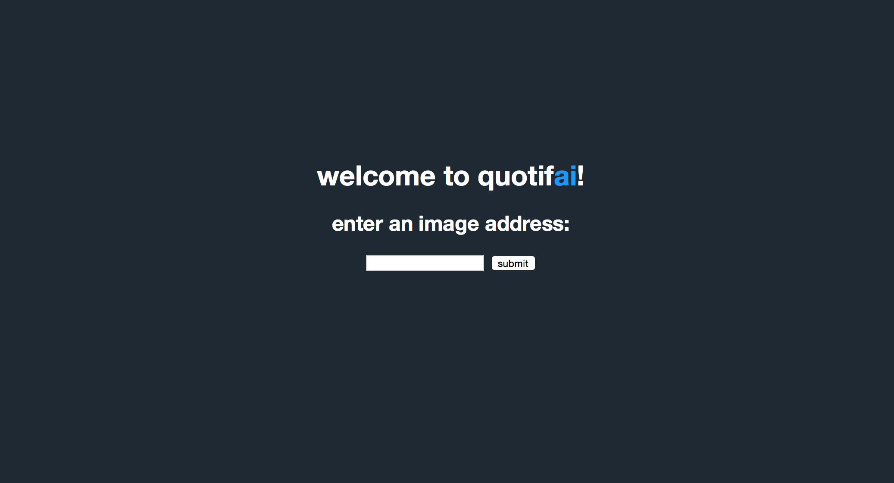

# quotifai

> a web app that displays a quote related to a submitted image

### things I learned how to use:
- [Clarifai API](https://github.com/Clarifai/clarifai-python)
- [Flask](http://flask.pocoo.org/docs/0.11/quickstart/)
- [virtualenv](http://docs.python-guide.org/en/latest/dev/virtualenvs/)
- [BeautifulSoup](https://www.crummy.com/software/BeautifulSoup/bs4/doc/)